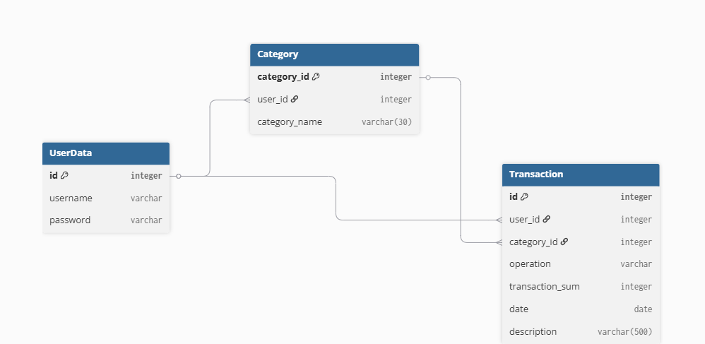

# Личные финансы

Веб-приложение для учёта доходов и расходов с диаграммой распределения затрат.

## Стек
- Python 3.14
- Django 6.0.5
- SQLite
- Chart.js (для круговой диаграммы с процентами)

## Возможности приложения
- Регистрация, вход и выход из учётной записи (каждый пользователь видит только свои данные).
- Добавление, изменение имени и удаление категорий.
- Добавление, редактирование и удаление финансовых транзакций.
- Фильтрация списка транзакций по выбранным датам.
- Сортировка таблицы транзакций по клику на стрелочки в шапке.
- Отображение круговой диаграммы расходов по категориям за выбранный период.

## Диаграмма базы данных
Ниже представлена схема таблиц, полей и связей между ними:



## Инструкция по запуску

1. Клонировать репозиторий:
   ```bash
   git clone https://github.com/Nicolay-Mindigaleev/Financial_accounting_system.git
   cd Financial_accounting_system
   ```

2. Создать виртуальное окружение:
   ```bash
   python -m venv venv
   ```

3. Активировать виртуальное окружение:
   - Для Windows: `venv\Scripts\activate`
   - Для macOS/Linux: `source venv/bin/activate`

4. Установить зависимости:
   ```bash
   pip install -r requirements.txt
   ```

5. Применить миграции базы данных:
   ```bash
   python manage.py migrate
   ```

6. Создать суперпользователя для входа в систему:
   ```bash
   python manage.py createsuperuser
   ```

7. Запустить сервер:
   ```bash
   python manage.py runserver
   ```
   Приложение откроется по адресу: http://127.0.0

## Дополнительные команды

 - Загрузка резервной копии данных (при наличии файла):
  ```bash
  python manage.py loaddata backup.json
  ```
- Запуск автотестов:
  ```bash
  python manage.py test
  ```
- Проверка стиля кода через линтер (при форматировании за основу бралось максимум 119 символов в строке):
  ```bash
  flake8 core/ --max-line-length=119
  ```
